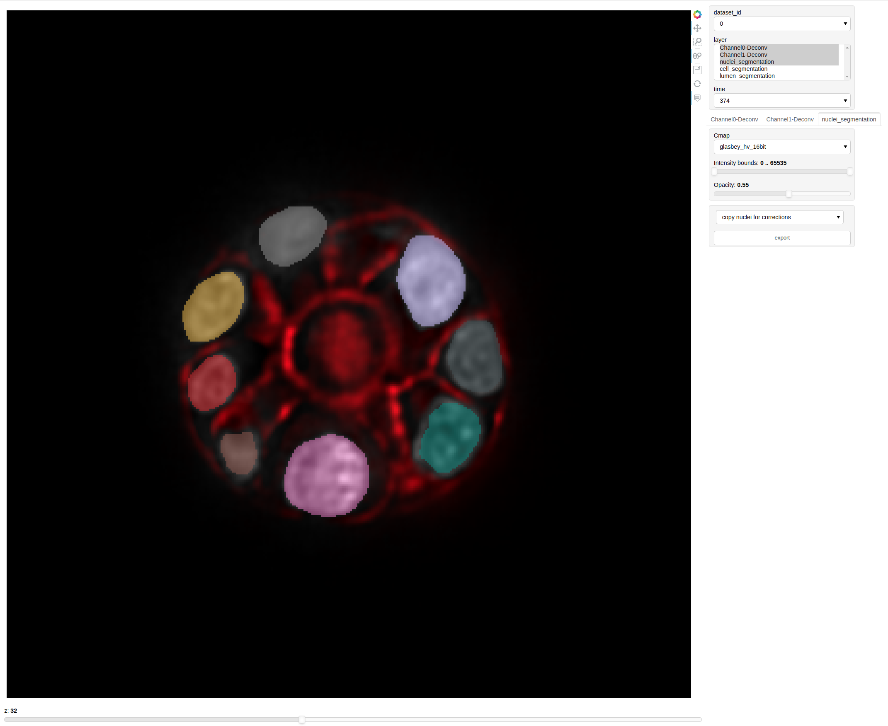
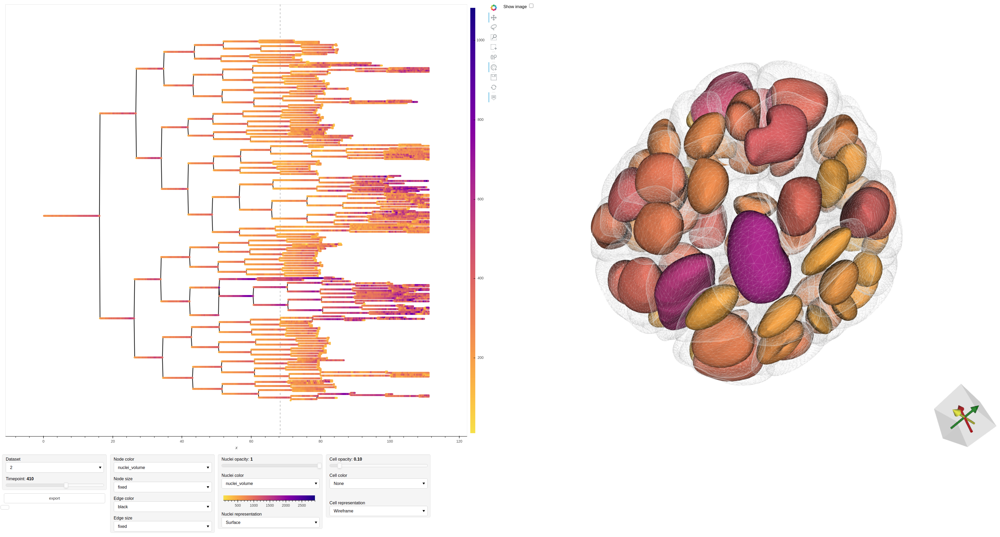
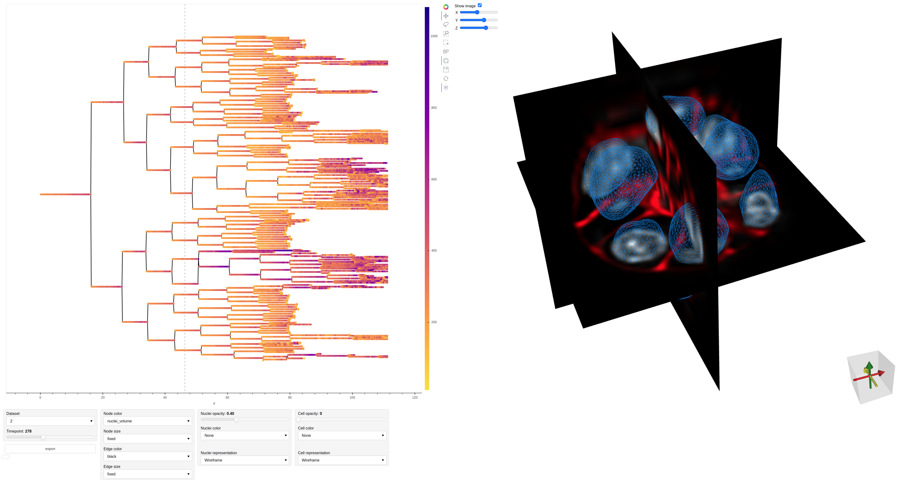
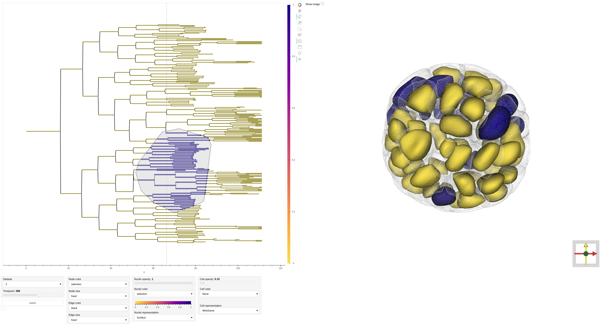

# LSTree

LSTree is a digital organoid and lineage tree extraction framework for light sheet movies. 

## Installation
It is recommended to create a new python environment and install visualization libraries and cuda (GPU support) with conda:

```bash
conda create -n lstree python=3.7
conda activate lstree
conda install -c pyviz holoviews bokeh panel param xarray datashader pytables
conda install cudatoolkit=10.1 cudnn=7

git clone https://github.com/fmi-basel/LSTree.git
pip install LSTree/
```

## Usage
The entire analysis pipeline is implemented as a Luigi workflow [https://github.com/spotify/luigi] and majors steps can be run with the commands detailed below. Jupyter notebooks for interactive visualization of the result and drawing training labels are also provided.

### Quickstart
Acquired movie should first be cropped (see below) to reduce memory requirements and processing time. Then, provided that initial nuclei and lumen annotations, as well as lineage tree (generated/curated with Mastodon) are available, the entire pipeline can be triggered with:

```bash
LUIGI_CONFIG_PATH=./config.cfg luigi --local-scheduler --module lstree ViewerTask
```


By default this command will run on the test dataset provided (003-20170313-P4-25X-Enterocyst) using all models trained with intestinal organoid images. The configuration file must be first adapted to the right input paths before using it on new user data.


---
**NOTE**
If there are samples for which the output files already exist, then these are skipped. To rerun the workflow all necessary intermediate and final outputs should be deleted. That also include training deep learning models, i.e. if a trained model exist, it is used without retraining.

---


### Minimum requirements
This workflow was tested on linux machines and is implemented using multiprocessing. It will therefore run faster with more CPUs/GPUs available and requires at least:

- 16 GB of RAM
- TensorFlow compatible GPU with >8 GB of VRAM

The size of the deep learning models might need to be adjusted based on the available VRAM during training.

### Folder structure
The data are expected to be organized with 2-level sub-folders for movie and channels respectively:

```bash
.
└── MOVIE_DIRECTORY
    ├── experiment.json
    ├── mamut.xml
    ├── nuclei_annot
    │   ├── FILENAME-T0017.tif
    │   ├── FILENAME-T0134.tif
    │   └── FILENAME-T0428.tif
    ├── lumen_annot
    │   ├── FILENAME-T0024.tif
    │   ├── FILENAME-T0245.tif
    │   └── FILENAME-T0712.tif
    ├── Channel0
    │   ├── FILENAME-T0001.tif
    │   ├── FILENAME-T0002.tif
    │   ├── FILENAME-T0003.tif
    │   ├── FILENAME-T0004.tif
    │   ├── FILENAME-T0005.tif
    │   .
    │   └── FILENAME-Tnnnn.tif
    └── Channel1
        ├── FILENAME-T0001.tif
        ├── FILENAME-T0002.tif
        ├── FILENAME-T0003.tif
        ├── FILENAME-T0004.tif
        ├── FILENAME-T0005.tif
        .
        └── FILENAME-Tnnnn.tif
 ```

Generated outputs will appear as new sub-folders (Channel0-Deconv, Channel1-Deconv, nuclei_segmentation, cell_segmentation, etc.). Each movie folder should include a `mamut.xml` linage tree (see Lineage tree section below) and an `experiment.json` file containing information about acquisition settings:

```
{
    "mag": 25,
    "time_interval": 0.1667,
    "spacing": [
        2,
        0.26,
        0.26
    ],
    "wavelengths": {
        "Channel0": 488,
        "Channel1": 561,
        "Channel2": 638
    }
}
```  


### Configuration
General parameters for each tasks are configured through a global configuration file [config.cfg](config.cfg). For instance deconvolution parameters common to all images can be controlled by:

```
[DeconvolutionTask]
psf_dir=PATH_TO_PSF_IMAGES
out_suffix=-Deconv
niter=128
max_patch_size=(9999,9999,9999)
```

### Cropping lightsheet movies
Organoids' bounding boxes are first determined on a reference channel and independently for each frame using x,y and z maximum intensity projections (MIPs). Since multiple organoids might appear in the field of view (especially at early time-points), the largest object (or a manually selected object) on the last frame is tracked backward in time by finding its closest match in the previous frame until the first frame is reached. The minimum crop size required for the entire movie is then computed along each axis. At this point crops are reviewed with the included tool: [crop_movie.ipynb](notebooks/crop_movie.ipynb) and manual corrections can be made, for instance to account for stage movements during medium change. Finally all time-points and channels are cropped by centering the global bounding box on the tracked organoid.

<br>

### Deconvolution
Raw images are first denoised with a model trained with the Noise2Void scheme on a few images randomly selected from each movies/channels. The minimum intensity projection along z is used to estimate the background image under the assumption that for each pixel the background is visible on at least one z-slice. Denoised and background-corrected images are then deconvolved with a measured PSF using Richardson-Lucy algorithm running on the GPU. This step, including training the denoising model if needed, can be run manually with:

```bash
LUIGI_CONFIG_PATH=./config.cfg luigi --local-scheduler --module lstree MultiDeconvolutionTask
```

### Lineage tree
Initially nuclei have to be tracked manually using [Mastodon](https://github.com/mastodon-sc/mastodon) Fiji plugin. Subsequently a deep learning model can be (re)trained to predict trees that require fewer manual corrections.

```bash
LUIGI_CONFIG_PATH=./config.cfg luigi --local-scheduler --module lstree MultiBuildTreeTask
```

The tree prediction outputs include a `.xml` file that can be opened with Mastodon as well as a plots of the predicted tree with overlaid information to facilitate corrections (e.g. nuclei volume, tracking embedding distance).

<br>

### Nuclei segmentation
Nuclei are segmented in 3D following previously reported method: [RDCNet: Instance segmentation with a minimalist recurrent residual network](https://github.com/fmi-basel/RDCNet). A deep learning model model is trained with a mix of complete and partial annotations. Partial labels are obtained by placing a spheres at the position of each tracked nuclei. A small subset of the frames are fully annotated by manually expanding the labels to the full nuclei. Labels can be edited with the provided [notebook](notebooks/3D_annotator.ipynb). Model architecture and training parameters can be controlled as illustrated in the example configuration file. In particular, initial weights can be supplied with the `resume_weights` option to refine an existing model. To train a model run:

```bash
LUIGI_CONFIG_PATH=./config.cfg luigi --local-scheduler --module lstree NucleiSegmentationTrainingTask
```

At the beginning of the training, a pdf `training_samples.pdf` is exported in the model folder to check that pre-preprocessing steps worked as expected. Training losses can be inspected with Tensorflow TensorBoard `tensorboard --logdir MODEL_FOLDER`. Once the model is trained, nuclei segmentations are predicted using the tracking seeds to enforce the correct number of nuclei and hence temporal consistency. Provided that the .xml lineage tree exist, corresponding nuclei can be segmented with:

```bash
LUIGI_CONFIG_PATH=./config.cfg luigi --local-scheduler --module lstree MultiNucleiSegmentationTask
```

### Cell and lumen segmentation
Cell and lumen segmentation also expand on the [RDCNet](https://github.com/fmi-basel/RDCNet) method. The semantic branch predicts 3 classes, background, lumen, epithelium and is supervised by manual annotations of a few frames per datasets. No manual annotations of individual cells is required. Instead the previously segmented nuclei are used as partial annotations under the assumption that they are randomly distributed within the cell compartment. Labels of nuclei belonging to multi-nucleated cells are merged based on the tracking information. Since only the membrane channel is provided as input, the network is forced to learn to segment cells. In practice nuclei are not completely randomly distributed (e.g. corners, tapered elongated cells). We therefore also add a regularization term that encourages voxels in unsupervised regions to vote for one of the instances (without enforcing which one) which yield reasonable cell segmentation in most cases. To train a model run:

```bash
LUIGI_CONFIG_PATH=./config.cfg luigi --local-scheduler --module lstree CellSegmentationTrainingTask
```

Lumen segmentation and, if lineage tree exists, cell segmentation can be generated with:
```bash
LUIGI_CONFIG_PATH=./config.cfg luigi --local-scheduler --module lstree MultiCellSegmentationTask
```

### Features extraction
Organoid-level features (volume, lumen volume, etc.) and cell-level features (cell/nuclei volume, aspect ratio, distance to lumen, etc.) can be extracted with:
```bash
LUIGI_CONFIG_PATH=./config.cfg luigi --local-scheduler --module lstree MultiAggregateFeaturesTask
```
or only organoid-level features if the lineage tree is not available with:
```bash
LUIGI_CONFIG_PATH=./config.cfg luigi --local-scheduler --module lstree MultiAggregateOrganoidFeaturesTask
```

It creates a *.csv file containing the extracted features for each timepoint as well as final a *.hdf file with all time-points aggregated. The *.hdf file contains Pandas DataFrames of nodes and edges with the associated features which can be used to plot lineage trees as illustrated in [plot_features.ipynb](notebooks/plot_features.ipynb).

Alternatively, a generic set of features can be extracted from all combination of intensity images and labels. This can be useful to use externally generated labels. To replace the default feature extraction task, add and adapt the following to the configuration file:

```
[GenericExtractFeaturesTask]
out_subdir=features
label_subdirs=["nuclei_segmentation", "nuclei_surround"]
raw_channel_subdirs=["Channel01", "Channel02"]

[AggregateFeaturesTask]
extractor_type=generic
```

### Generating training labels
**3D annotator**<br>
<br>

The segmentation pipeline requires manual annotations of nuclei and lumen/epithelium. The provided [3D_annotator.ipynb](notebooks/3D_annotator.ipynb) can be used to generate 3D segmentation labels. Once an initial segmentation output is generated, it becomes much faster to handpick bad samples and correct them. The [segmentation_viewer.ipynb](notebooks/segmentation_viewer.ipynb) notebook allows quickly inspecting the current segmentation and copying files to be corrected in a separate folder in one click.


**Segmentation viewer**<br>
<br>

### Visualization
The included web-based viewer allows visualizing a lineage tree with a linked view of the 3D cell/nuclei segmentation at a given timepoint.  

Extracted features such as the nuclei volume can be viewed as color:  
<br>

Orthogonal views of the original image can be displayed to double check the segmentation:  
<br>

It is also possible to highlight certain areas of the tree by manual selection:  
<br>

To be responsive, the viewer rely on smoothed 3D meshes pre-generated from the segmentation stacks with:
```bash
LUIGI_CONFIG_PATH=./config.cfg luigi --local-scheduler --module lstree ViewerTask
```

The viewer is then accessible either as a jupyter notebook [notebook](webview/webview.ipynb) or directly served to the browser by running:

```bash
cd webview
panel serve --static-dirs static_data="static_data" --show webview/webview.ipynb --args --basedir PATH_TO_PROCESSED_DATA
```

or on a remote machine:

```bash
cd webview
panel serve --static-dirs static_data="static_data" --port PORT --allow-websocket-origin WORKSTATION:PORT webview.ipynb  --args --basedir PATH_TO_PROCESSED_DATA
```


## Implementation details
- The workflow and its tasks'dependencies are managed using [Luigi](https://github.com/spotify/luigi).
- Processing steps are batched per movie/channel to amortize tensorflow model initialization.
- Due to current tensorflow limitations, tensorflow should not be imported (directly or indirectly) in the main process but in the `run()` function of each Luigi task (i.e. in sub-processes spawned by Luigi)
- Negative labels in training annotations are considered "not labeled" and do not contribute to the training loss (partial annotations)
