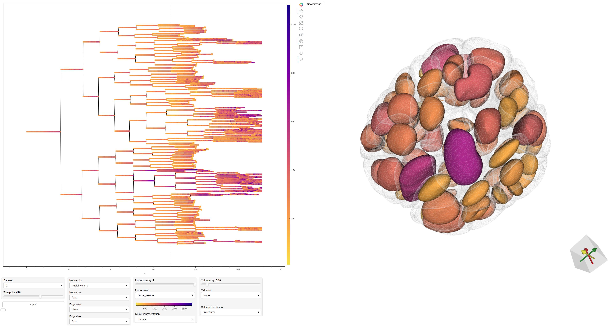
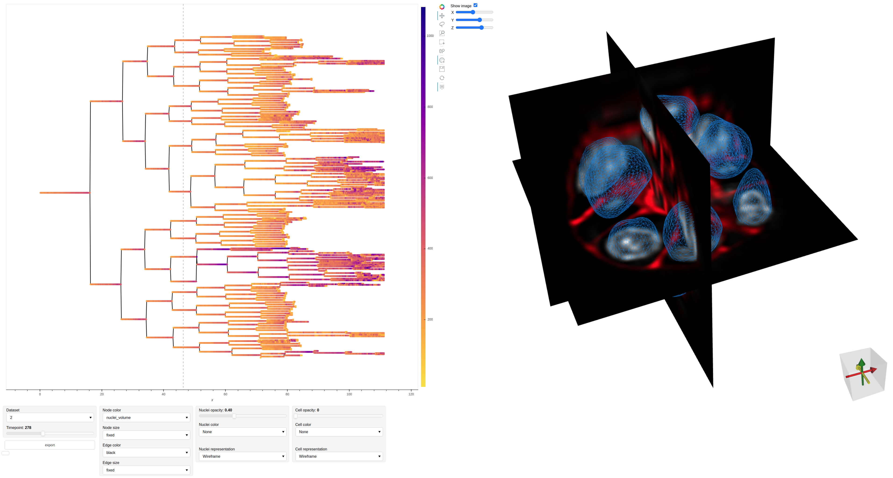
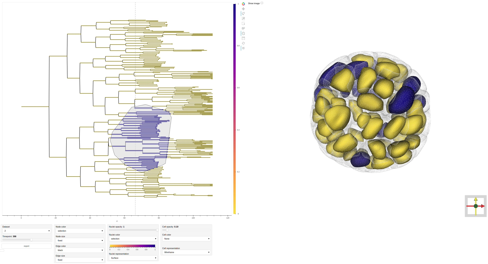

# Introduction - Webviewer

The included web-based viewer allows visualizing a lineage tree with a linked view of the 3D cell/nuclei segmentation at a given timepoint.  

<!--  -->

Extracted features such as the nuclei volume can be viewed as color:  
<br>

Orthogonal views of the original image can be displayed to double check the segmentation:  
<br>

It is also possible to highlight certain areas of the tree by manual selection:  
<br>

To be responsive, the viewer relies on smoothed 3D meshes pre-generated from the segmentation stacks with:
```bash
LUIGI_CONFIG_PATH=./config.cfg luigi --local-scheduler --module lstree ViewerTask
```

## Running via the notebook / port forwarding
You can run the Webviewer via the jupyter [notebook](webview.ipynb). This is a good first way to look at the tree-meshes visualization, as it is set to look initially at the processed example datasets.

Alternatively, you can also use port forwarding to serve trhe notebook for remote visualization.

The viewer is then accessible either as a jupyter notebook  or directly served to the browser by activating the lstree environment and running:

```bash
cd /PATH_TO_LSTREE_REPOSITORY/webview
panel serve --static-dirs static_data="static_data" --show webview/webview.ipynb --args --basedir PATH_TO_PROCESSED_DATA
```

or on a remote machine:

```bash
cd /PATH_TO_LSTREE_REPOSITORY/webview
panel serve --static-dirs static_data="static_data" --port PORT --allow-websocket-origin=WORKSTATION:PORT webview.ipynb  --args --basedir PATH_TO_PROCESSED_DATA
```

Example:

```bash
cd /LSTree/webview
panel serve --static-dirs static_data="static_data" --port 7007 --allow-websocket-origin=workstation1:7007 webview.ipynb  --args --basedir /LSTree/data
```

